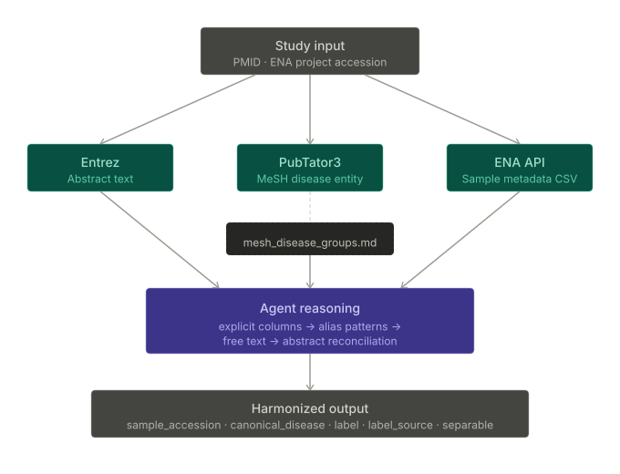

# ENA Metadata Harmonization

Claude Code plugin for fetching and analyzing microbiome metadata: extract paper abstracts, retrieve disease annotations, fetch ENA sample metadata, and classify samples into cohorts. Works as a unified tool — invoke the skill and it guides you through the workflow you need.

## Pipeline



## Install

```
/plugin marketplace add AlanThisis/ENA-metadata-harmonization
/plugin install microbiome-harmonization@mmc-plugins
```

Requires [`uv`](https://github.com/astral-sh/uv) on your PATH.

## Usage

The skill provides multiple workflows. Invoke it and it will ask clarifying questions based on what you're trying to do.

```
/microbiome-harmonization:harmonize
```

### Classify samples into disease/control cohorts

When you have a paper ID and ENA project accession:

1. The skill fetches the paper abstract and MeSH disease annotations
2. Retrieves sample-level ENA metadata
3. Probes the metadata for case/control signals (explicit fields, alias patterns, abstract language)
4. Extracts phenotypic data (age, sex, disease) when available
5. Produces output with sample assignments, confidence, and separability flags

**Example:**

```
/microbiome-harmonization:harmonize PMC10797958 PRJEB46665
```

Or provide inputs interactively:

```
/microbiome-harmonization:harmonize classify PMC10797958 PRJEB46665 into disease vs control cohorts
```

**What you're classifying:**
- **Paper**: [PMC10797958 on PubMed Central](https://pmc.ncbi.nlm.nih.gov/articles/PMC10797958/) — abstract and disease context
- **Study**: [PRJEB46665 on ENA](https://www.ebi.ac.uk/ena/browser/view/PRJEB46665) — sample metadata
- **Disease annotations**: [PubTator3 view](https://www.ncbi.nlm.nih.gov/research/pubtator3/publication/25432777) for the PMID (MeSH disease terms)
- **Example sample**: [SAMEA9544267](https://www.ebi.ac.uk/ena/browser/view/SAMEA9544267) — shows host age, sex, and disease status in metadata

**Output** includes: `sample_accession`, `label` (disease/control/other/unresolved), `label_source`, `confidence`, phenotypic data (`age`, `sex`, `disease`), `separable` flag, and `notes`.

### Bulk-fetch abstracts from a CSV

When you have a CSV with paper IDs and want abstracts without burning tokens:

```
/microbiome-harmonization:harmonize bulk-fetch abstracts from my_papers.csv where column 2 has PMC IDs
```

The skill will extract IDs and run the fetch as a background command, reporting when done without loading all abstracts into context.

### Find ENA studies from a paper

When you want to know what ENA projects are mentioned in a paper:

```
/microbiome-harmonization:harmonize find ENA accessions in PMC10797958
```

The skill scans the PMC full-text and returns ENA/SRA project accession numbers via regex.

### Inspect sample metadata directly

When you want to explore an ENA project without classification:

```
/microbiome-harmonization:harmonize fetch and show me the metadata structure for PRJEB46665
```

The skill will retrieve sample-level data and help you probe columns with shell/Python tools to understand the structure.

---

## Built-in Scripts

The skill orchestrates four underlying scripts. You can also invoke them directly if needed:

### get_abstracts.py

```bash
uv run --with requests python3 ${CLAUDE_PLUGIN_ROOT}/scripts/get_abstracts.py <PMID_or_PMCID> [<PMID_or_PMCID> ...] [-o output.csv]
```

Fetches abstract text from NCBI PubMed/PMC. Single ID prints to stdout; multiple IDs produce CSV. Run with `-h` for all options.

### get_disease_entities.py

```bash
uv run --with requests python3 ${CLAUDE_PLUGIN_ROOT}/scripts/get_disease_entities.py <PMID_or_PMCID> [<PMID_or_PMCID> ...] [-o output.csv]
```

Retrieves MeSH disease annotations from PubTator3. Single ID prints one disease per line (name<TAB>mesh_id); multiple IDs produce CSV with semicolon-separated disease_names and disease_ids. Run with `-h` for all options.

### get_ena_project_samples.py

```bash
uv run --with requests python3 ${CLAUDE_PLUGIN_ROOT}/scripts/get_ena_project_samples.py <ENA_ACCESSION> [-o output.csv] [--max-samples N]
```

Fetches flattened sample-level metadata from ENA. Use `--max-samples N` for quick inspections on large studies. Run with `-h` for all options.

### get_ena_accession.py

```bash
uv run --with requests python3 ${CLAUDE_PLUGIN_ROOT}/scripts/get_ena_accession.py <PMID_or_PMCID> [<PMID_or_PMCID> ...] [-o output.csv]
```

Fetches PMC full-text XML and extracts ENA/SRA project accessions via regex. Single ID prints accessions one per line; multiple IDs produce CSV. Run with `-h` for all options.

## Local development

```bash
claude --plugin-dir ./plugins/microbiome-harmonization
```

After editing skill or script files, run `/reload-plugins` to pick up changes.
